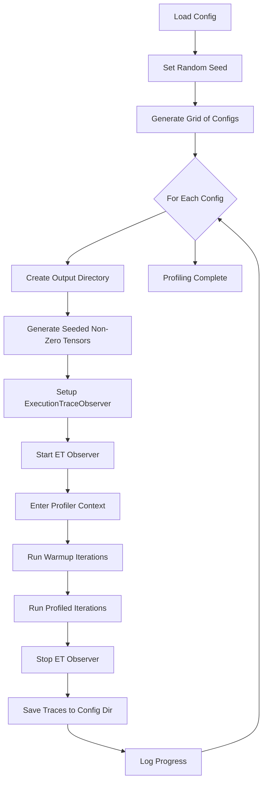

# Matmul Profiling Infrastructure

## Overview

Create the foundational profiling system that generates PyTorch Profiler traces (Kineto + Chakra ET) for matrix multiplications across a configurable parameter space. Processing and analysis of traces will be handled separately later.

## File Structure

```javascript
compute/
├── profile_llm.py              (existing)
├── profile_matmul.py           (main profiling script - runs experiments)
├── matmul_config.py            (configuration definitions and grid generator)
└── traces_matmul/              (output directory for all traces)
    ├── config_0001/
    │   ├── CPU_trace.json      (Chakra ET format)
    │   └── *.pt.trace.json     (Kineto traces)
    ├── config_0002/
    └── ...
```


## Core Components

### 1. [`compute/matmul_config.py`](compute/matmul_config.py)

Configuration file with:**Parameter Definitions:**

- Matrix size options (M, N, K tuples)
- Precision options (fp32, fp16, bf16, int8)
- Memory layout options (transpose A/B combinations)
- Batch size options
- Device selection

**Boolean Flags to Control Search Space:**

```python
ENABLE_SIZE_SEARCH = True          # Search over different matrix sizes
ENABLE_PRECISION_SEARCH = True     # Search over different precisions
ENABLE_LAYOUT_SEARCH = True        # Search over transpose configurations
ENABLE_BATCH_SEARCH = True         # Search over batch sizes
ENABLE_RECTANGULAR = False         # Include non-square matrices
```

**Profiling Settings:**

```python
WARMUP_ITERATIONS = 3              # Warmup before profiling
REPEAT_COUNT = 5                   # Number of repeats per config (increase to 30 later)
WAIT_STEPS = 1
ACTIVE_STEPS = 1
RANDOM_SEED = 42                   # Seed for reproducible tensor generation
```

**Grid Generator Function:**

```python
def generate_experiment_configs():
    """
    Returns list of config dicts based on enabled flags.
    Each config dict contains: m, n, k, dtype, transpose_a, 
    transpose_b, batch_size, device
    """
```


### 2. [`compute/profile_matmul.py`](compute/profile_matmul.py)

Main profiling script structure (similar to [`profile_llm.py`](compute/profile_llm.py)):

```python
# Import config and grid generator
from matmul_config import generate_experiment_configs, WARMUP_ITERATIONS, REPEAT_COUNT, RANDOM_SEED

# Set random seed for reproducibility
torch.manual_seed(RANDOM_SEED)

# For each config in grid:
#   1. Create output subdirectory for this config
#   2. Generate dummy tensors with specified shape/dtype/layout/device
#   3. Setup ExecutionTraceObserver (Chakra ET)
#   4. Wrap matmul in torch.profiler.profile context
#   5. Run warmup iterations
#   6. Run profiled iterations with prof.step()
#   7. Save traces to config-specific directory
#   8. Log progress
```

**Key Features:**

- Use same profiling setup as LLM profiler (ExecutionTraceObserver + torch.profiler)
- Each configuration writes to separate subdirectory
- Progress logging to track which configs have been profiled
- Handle device compatibility (skip bf16 on devices without support)

### 3. Parameterized Matmul Function

Core operation wrapper:

```python
def run_matmul(A, B, transpose_a=False, transpose_b=False):
    """Execute matmul with optional transposes"""
    if transpose_a:
        A = A.transpose(-2, -1)
    if transpose_b:
        B = B.transpose(-2, -1)
    return torch.matmul(A, B)
```


### 4. Tensor Generation (Non-Zero, Seeded)

```python
def create_tensors(m, n, k, dtype, batch_size, device, transpose_a, transpose_b):
    """
    Generate random NON-ZERO tensors for matmul with specified config.
    
    Uses torch.rand() + offset to ensure all values are non-zero.
    This prevents hardware sparsity optimizations from affecting results.
    
    Seeding is handled globally via torch.manual_seed() for reproducibility.
    
    Handles batching and creates properly shaped tensors.
    Returns: (A, B) ready for matmul
    """
    # Generate non-zero values: range [0.1, 1.1] instead of [0, 1]
    # This ensures no zeros while maintaining reasonable numeric range
```


### 5. Seeding Strategy

**Reproducibility approach:**

- Set `torch.manual_seed(RANDOM_SEED)` at start of profiling script
- If using CUDA: also set `torch.cuda.manual_seed(RANDOM_SEED)`
- Tensor generation uses `torch.rand(...) + 0.1` to ensure all values in [0.1, 1.1]
- This ensures exact same tensors across runs while avoiding zeros

## Profiling Workflow




## Configuration Example

For a focused experiment, set flags in `matmul_config.py`:

```python
# Start small - just test precision impact on fixed size
ENABLE_SIZE_SEARCH = False
ENABLE_PRECISION_SEARCH = True
ENABLE_LAYOUT_SEARCH = False
ENABLE_BATCH_SEARCH = False

# Will only test these if ENABLE_SIZE_SEARCH = True
MATRIX_SIZES = [(1024, 1024, 1024)]  # Fixed size
PRECISIONS = ['fp32', 'fp16', 'bf16']  # Test all precisions
```

This generates 3 configs total (one per precision).

## Implementation Steps

1. Create `matmul_config.py` with all parameter definitions, boolean flags, random seed, and grid generator
2. Implement tensor creation with non-zero seeded generation and matmul wrapper functions  
3. Build main profiling loop in `profile_matmul.py` with proper profiler setup (ExecutionTraceObserver + torch.profiler)
4. Add progress logging and directory management
5. Test with small config space (1-3 configs) to verify traces are generated correctly and tensors are reproducible

## Notes

- All traces write to separate subdirectories to avoid conflicts
- Trace processing and metrics extraction deferred to future work
- Start with REPEAT_COUNT=5, can increase to 30 for confidence intervals later
- Boolean flags allow quick iteration on specific dimensions without regenerating full grid
- Non-zero tensors prevent hardware sparsity optimizations from skewing results